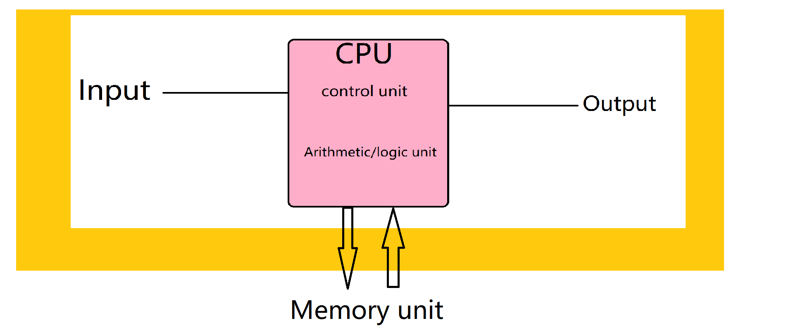

## 1、列出冯诺依曼结构下一台计算机的基本部分

## 2、64MB的内存要多少位的地址
20+6=26要26位的地址(it needs 26 bits to adress.)

## 3、列出CPU的基本部分
CPU包含：1、运算器(ALU, Arithmetic Logic Unit,  算数逻辑运算单元)
           
           2、高速缓冲存储器(Cache).

           3、*数据(Data)、控制及状态的总线(Bus)

           故当然包含Cache；

## 4、何为二级存储？用你的电脑搞一搞。
>二级存储就是除了计算机主存储器或内存之外的所有可访问数据存储器<

>二级存储设备对于俺的电脑来说有：固态硬盘，机械硬盘 。然后就没有然后了……

## 5、用维基百科解释：
### CPU
>A central processing unit (CPU) is the electronic circuitry within a computer that carries out the instructions of a computer program by performing the basic arithmetic, logical, control and input/output (I/O) operations specified by the instructions. The computer industry has used the term "central processing unit" at least since the early 1960s. Traditionally, the term "CPU" refers to a processor, more specifically to its processing unit and control unit (CU), distinguishing these core elements of a computer from external components such as main memory and I/O circuitry.

### RAM
>Random-access memory  is a form of computer data storage that stores data and machine code currently being used. A random-access memory device allows data items to be read or written in almost the same amount of time irrespective of the physical location of data inside the memory. In contrast, with other direct-access data storage media such as hard disks, CD-RWs, DVD-RWs and the older magnetic tapes and drum memory, the time required to read and write data items varies significantly depending on their physical locations on the recording medium, due to mechanical limitations such as media rotation speeds and arm movement.

### ROM
>Read-only memory (ROM) is a type of non-volatile memory used in computers and other electronic devices. Data stored in ROM can only be modified slowly, with difficulty, or not at all, so it is mainly used to store firmware (software that is closely tied to specific hardware, and unlikely to need frequent updates) or application software in plug-in cartridges.

### Bus(computer)
>In computer architecture, a bus (a contraction of the Latin omnibus) is a communication system that transfers data between components inside a computer, or between computers. This expression covers all related hardware components (wire, optical fiber, etc.) and software, including communication protocols.

### Parallel computing
>Parallel computing is a type of computation in which many calculations or the execution of processes are carried out simultaneously. Large problems can often be divided into smaller ones, which can then be solved at the same time. There are several different forms of parallel computing: bit-level, instruction-level, data, and task parallelism. Parallelism has long been employed in high-performance computing, but it's gaining broader interest due to the physical constraints preventing frequency scaling. As power consumption (and consequently heat generation) by computers has become a concern in recent years,parallel computing has become the dominant paradigm in computer architecture, mainly in the form of multi-core processors.

## 6、云计算
云计算就是拥有灵活性、全自动、既能管理资源又能管理应用、能赚钱也能提升个人实力的一个服务。

## 7、来研究小孙的主板
### 1)DDR3内存：3就是这个内存的第三代啦、1333是内存分频率啦。

### 2)用1600能提升性能吗？：不行啊， 你看这个频率不符合主板支持的啦。

### 3)换4G*2的1333呢？：行的，双通道会提升总线带宽，但效果不拔群。

### 4)16G要多少位地址：34

另DDR3 SDRAM：

>第三代双倍数据率同步动态随机存取存储器（Double-Data-Rate Three Synchronous Dynamic Random Access Memory，一般称为DDR3 SDRAM），是一种计算机存储器规格。它属于SDRAM家族的存储器产品，提供相较于DDR2 SDRAM更高的运行性能与更低的电压，是DDR2 SDRAM（四倍数据率同步动态随机存取存储器）的后继者（增加至八倍）。

