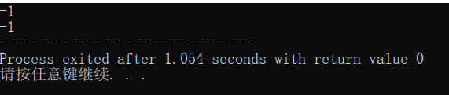

# 1 阅读“伪代码”
### 1.用伪代码描述将十进制转化为16进制的方法
【10.->16.】

{

定义 “10”=‘A’   、 11=‘B’  、12=‘C’ 、 13=‘D’ 、 14=‘E’ 、 15=‘F’

输入一个十进制整数(n)；

b=a

如果b不等于0(n!=0)

b=b/16

mark++

以此判定n的十六进制需要多少位

array[mark]

重复

arrary[mark]=n%16

n=n/16

mark-1

________

### 2.C语言实现

### 3.使用 -1, 0, 1, 15, 26，3265 最为输入测试你的程序

# 2.名词解释与对比
### 1.Top-Down design(由上至下的设计)
这是一种自然直观的设计方法。首先确定用户级虚拟机器的基本特征、数据类型和基本命令等，而后再逐级向下设计，直到硬件执行或解释那级为止。当然每级设计过程中，既要考虑实现方法，也要考虑如何使上一级能优化实现。从考虑如何满足应用要求开始设计。缺点是应用的改变会带来系统效率的急剧下降。

### 2.Work breakdown structure (WBS)工作分解结构
以可交付成果为导向对项目要素进行的分组，它归纳和定义了项目的整个工作范围每下降一层代表对项目工作的更详细定义

### 3.有何异同
同：我觉得两种设计方法，都是通过把一个系统分成多个子系统来解决问题，由上至下是通过提出问题，然后呈树状图不断分解。而WBS则是对各种要素的分组，提高工作效率；

异：Top-Down design更注重的是由上至下，也就是我有了上一个问题才会引出下一个问题，逐级向下，实现优化。而WBS则是根据不同的类别把一个系统分成多个小的部分，理论上来说几个部分都是平等的。

# 3、仔细观察您洗衣机的运作过程，运用Top-down设计方法和Pseudocode 描述洗衣机控制程序。

我的洗衣机(叫小天鹅吧？)

正常洗衣运作过程：启动→选择程序→注水→浸泡→漂洗→转动脱水→提醒并结束。

伪代码：

1.启动电源(swicthon)

2.选择洗衣模式(时间、注水量)

3.浸泡(计时)

4.机体转动(左转右转循环5次)

5.排水(计水位器)

6.脱水(顺时针高速转动)

7.提醒并结束(响声)

进一步完善：

1.READ 洗衣模式

2.IF 水位达到标准

    THEN 注水

3.IF 时间未达到要求

    THEN 浸泡

4.REPEAT 电机左转5次、右转5次、计时

    UNTIL 时间=限定值

5.IF 水位不为0

    排水

    ENDIF

6.FOR(脱水时间>0)

    机体高速甩动

    ENDFOR

7.FOR(响铃时间>0)

    响起提示铃

    ENDFOR

8.关闭电源

# 3）根据你的实践，请分析“正常洗衣”与“快速洗衣”在用户目标和程序上的异同。你认为是否存在改进（创新）空间，简单说明你的改进意见？

异：快速洗衣取消浸泡过程

同：都有除浸泡外的相同洗衣过程

改进：快速洗衣可以突出快速因此减少洗衣或者脱水时间,或者增加同一时间内的洗衣、脱水效率。

# 4）通过步骤3），提取一些共性功能模块（函数），简化“正常洗衣”程序，使程序变得更利于人类理解和修改维护。

共性功能：

wait(time) //等待指定的时间；

注水(volume,timeout) //在指定时间内完成注水，否则停机；

排水(timeout)。 等子程序
例子举得很好！！

