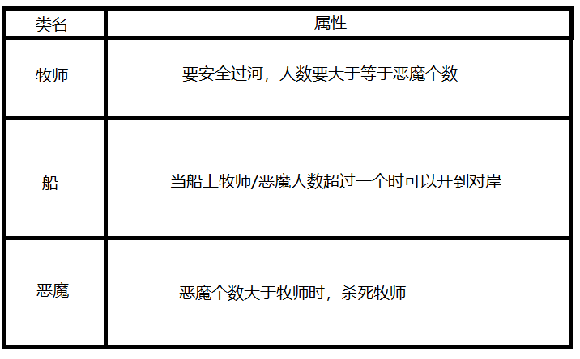

题目：
阅读“牧师与恶魔过河”的游戏介绍

并玩游戏。然后回答问题

## 1. 游戏涉及哪些类。请列表说明

---------

## 2.游戏中有哪些对象，各几个。例如，船（一个）
船(一个)、牧师(三个)、恶魔(三个)。

-----
## 3.类和对象的区别是什么？举一个例子说明
类是对象的抽象化，它不占用内存空间。

对象是类的具象，它占有内存空间。

他们之间的关系类似于模板与实例

例子：鸟类是一种类，而姆克鹰则是一个对象。

## 4.游戏中的魔鬼，有哪些属性和方法？
恶魔的属性：大小、角度、图片、运动方向、名字、还有恶魔初始站的位置，以及下船后站的位置。

恶魔的方法(可执行的操作)：上船、下船。

## 5.– 假设魔鬼被鼠标点中，会执行onclick事件，请用文字（伪代码）描述这个事件中魔鬼与其他对象沟通的过程。
- 如果鼠标点击岸上的恶魔

——> 所点恶魔走向船并坐下；

- 如果鼠标点击船上的恶魔

——> 所点恶魔下船并走到岸上的空位；

- 如果船靠岸的所有恶魔数量大于牧师数量或者另一边岸的恶魔数量大于牧师数量

——> 牧师死亡游戏结束

## 6.类或对象会是动词吗？

我觉得可以是一个动词吧，例如说函数是一个类，那么printf(C语言函数)就是一个对象，printf就是打印/输出的意思嘛。中国文化博大精深，名词作动词用的做法比比皆是，所以我充分觉得，极有可能回事动词！