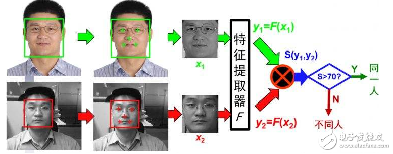
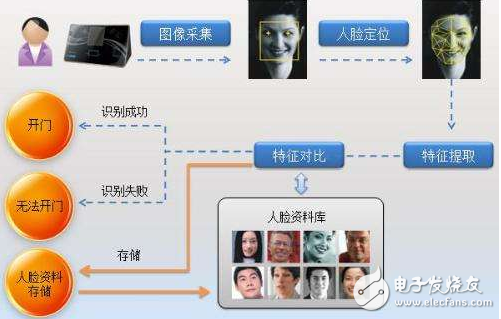

# 脸部识别技术是怎么运行的？

时至今日，人脸技术越发的成熟，公共的交通过关、手机的密钥都已经应用人脸识别技术了！那么这个神奇的技术，到底是怎么搞的呢？一开始我以为，真的是计算机长眼睛了，现在看来，真的是细分了多重运算，然后才实现了，人脸重合识别，达到各种效果！

## 下面小潘用自己的理解，谈谈这个脸部识别技术

### 第一步：识别脸部
就像我们人的眼睛一样，第一步肯定是眼睛看到了什么，然后把结果告诉大脑，大脑再来帮我们分析，所以计算机的脸部识别亦如此，通过摄像头探测人的脸部；

但是但是！我们的脸部不是单纯地出现在一张白纸这种背景之下的，计算机需要通过分析，把我们的脸从我们的背景里提取出来，那么这就用到下面几种办法！

(a.)参考模板法：
意思是，我们的数据库里会预先存放几个模板,然后通过摄像头采集的样品会与这些模板比对，然后就可以判断这个图片中是否出现了人脸！

(b.)人脸规则法： 
学美术的都知道，人脸是有比例之说的，每一块肌肉、骨架都是有逻辑可讲的.于是根据这种脸部结构分布的特征，人脸的规则就被预先定下来了，接下来计算机再根据样品与规则的比对，就可以判断图片中是否出现了人脸！

(c.)样品学习法： 
这个具体没搞懂,涉及到人工神经网络的范畴,大概就是对面象样品和非面相样品多次的比对，计算机能够学习如何分辨一张图是否存在面象（高深）！

(d.)肤色模型法: 
这个比较好懂，跟美图秀秀差不多，就是识别人脸肤色和环境颜色的差别，然后提取人脸出来，再来分析！

(e.)特征子脸法(相当抽象)：
网上说的大概就是，将所有的面象视为一个面象子空间,然后看这个图片样品在这个空间里的映射的投影之间的距离来判断是否存在面象.

### 第二步：人脸跟踪
这个就是说，我们人在例如过关的时候，不可能一动不动地让摄像头对着你看几秒吧，要呼吸，可能还会打喷嚏嘞，这个时候计算机要学会跟踪你的脸部，观察是不是一个真实的脸部，跟踪人脸动态行为可以通过肤色模型、或者是运动模型来实现！

### 第三步：人脸比对

这个我觉得是重头戏了，计算机会将采集到的样品和库存的面象进行比对！然后找出最佳的对象，所以面象的分析决定了面象识别的具体方法和性能。

#### 主要有以下两种办法：

(a.)特征向量法

根据眼睛的虹膜、鼻翼、嘴角等五官轮廓的大小、位置、距离等属性进行确定,然后把它们表示为几何特征量,然后这些特征量是成为描述这个脸部的一些特征向量，然后再进行比对。

(b.)面纹模板法

这个东西就厉害了，把样品的每个像素与库中的模板采用归一化相关量度量进行匹配,此外还能采用特征模型法进行比对；

 

再根据相关的编程、、我们最终就能得到我们生活中看到的

## 感想：
计算机的人脸识别，说白了就是计算，不过是细分的计算，每一个角度、尺度都精密的计算，像是把人具有的功能赋予给了计算机。人脸识别真的牛逼，现在的社会也得益于人脸识别变得越来越方便，我觉得我们的使命就是不断地探索、发现算法，然后把这些赋予给计算机，让计算机更好地服务人类、

