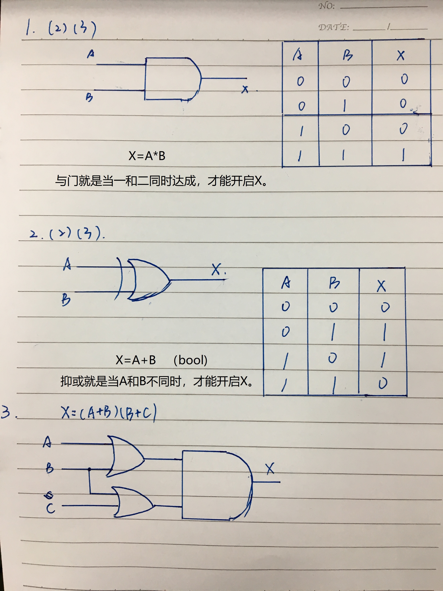
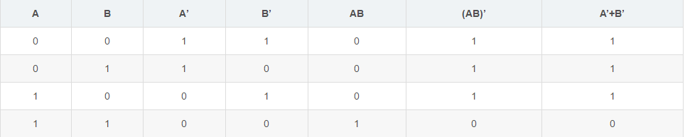

### 1、写出“与门”的三种表达，并用自己的话说说什么是与门；
### 2、写出“抑或门”的三种表达，并用自己的话说说什么是抑或门；
### 3、画出布尔式(A+B)(A+C)对应的电路图；

### 4、表现出以下电路图(在ppt上)的真值表.；

### 5、什么是电路等效性？用真值表表示式子 (AB)′=A′+B′ 
电路等效性：初中学过的把一个复杂的电路等效成一个简单的电路，大概就是在电路中各个元件的连接处找到与其电势相等的等势点，元件可以等效于接在等势点上，从而让复杂的电路变得简单。那么电路的等效性就是说明电路中势能相等的点的性质一样。

#### (AB)'=A'+B'的真值表！

### 6、这儿有8个1位的全加整型电路.把它们组合起来成为一个 8位加法电路.

### 7、位与 位或 位抑或
i.(0000X4+1 X3+1 X2+1 X1+1)2

ii.(X8⊕0 X7⊕0 X6⊕0 X5⊕0 X4⊕1 X3⊕1 X2⊕1 X1⊕1)2

iii.(X8X7X6X5X4X3X2X1)2

## Logic Gate
In electronics, a logic gate is an idealized or physical device implementing a Boolean function; that is, it performs a logical operation on one or more binary inputs and produces a single binary output. Depending on the context, the term may refer to an ideal logic gate, one that has for instance zero rise time and unlimited fan-out, or it may refer to a non-ideal physical device[1] (see Ideal and real op-amps for comparison).

Logic gates are primarily implemented using diodes or transistors acting as electronic switches, but can also be constructed using vacuum tubes, electromagnetic relays (relay logic), fluidic logic, pneumatic logic, optics, molecules, or even mechanical elements. With amplification, logic gates can be cascaded in the same way that Boolean functions can be composed, allowing the construction of a physical model of all of Boolean logic, and therefore, all of the algorithms and mathematics that can be described with Boolean logic.

Logic circuits include such devices as multiplexers, registers, arithmetic logic units (ALUs), and computer memory, all the way up through complete microprocessors, which may contain more than 100 million gates. In modern practice, most gates are made from field-effect transistors (FETs), particularly metal–oxide–semiconductor field-effect transistors (MOSFETs).

Compound logic gates AND-OR-Invert (AOI) and OR-AND-Invert (OAI) are often employed in circuit design because their construction using MOSFETs is simpler and more efficient than the sum of the individual gates.

In reversible logic, Toffoli gates are used.

## Boolean algebra
In mathematics and mathematical logic, Boolean algebra is the branch of algebra in which the values of the variables are the truth values true and false, usually denoted 1 and 0 respectively. Instead of elementary algebra where the values of the variables are numbers, and the prime operations are addition and multiplication, the main operations of Boolean algebra are the conjunction and denoted as ∧, the disjunction or denoted as ∨, and the negation not denoted as ¬. It is thus a formalism for describing logical relations in the same way that elementary algebra describes numeric relations.

Boolean algebra was introduced by George Boole in his first book The Mathematical Analysis of Logic (1847), and set forth more fully in his An Investigation of the Laws of Thought (1854). According to Huntington, the term "Boolean algebra" was first suggested by Sheffer in 1913, although Charles Sanders Peirce in 1880 gave the title "A Boolian Algebra with One Constant" to the first chapter of his "The Simplest Mathematics". Boolean algebra has been fundamental in the development of digital electronics, and is provided for in all modern programming languages. It is also used in set theory and statistics.

## Flip-flop
1)触发器
2)能够存储1位二值信号（0或1）

