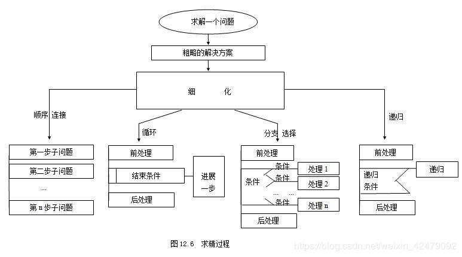
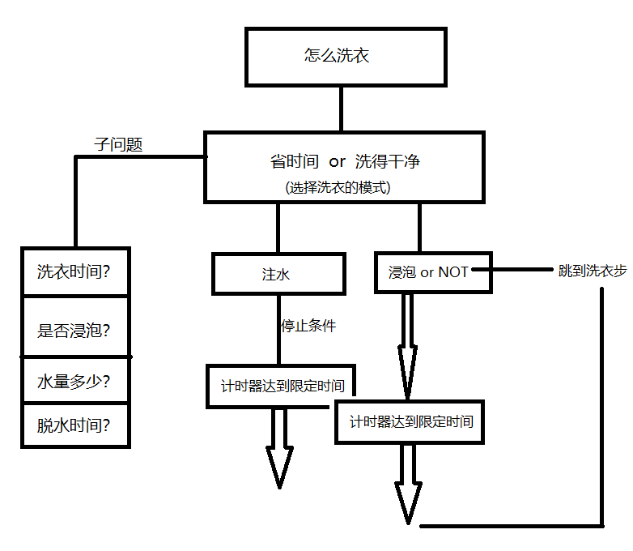

# 自顶向下 逐步求精！

至今，一直在寻找"最优化"的方法去生活，正如我高中数学老师说讲，我们总是找办法去“偷懒”，我们发展程序亦是如此，一个程序处理件事情如何做到最优化。例如导航系统，在你索引目标地点之后，导航系统会帮你安排多种路线“路程最短”、“过路费最便宜”、“时间最短”(出现拥堵情况)。我们知道线性空间中，从一个点到另一个点有无数种方法，那么导航系统又是如何从无数种方法中求出这几条线路的呢，这就是今天要讲的，逐步求精！

## 自顶向下（由上至下）是一种自然直观的设计方法

由上至下的设计思路：首先确定用户级虚拟机器的基本特征、数据类型和基本命令等，而后再逐级向下设计，直到硬件执行或解释那级为止。当然每级设计过程中，既要考虑实现方法，也要考虑如何使上一级能优化实现。从考虑如何满足应用要求开始设计。缺点是应用的改变会带来系统效率的急剧下降。

从图像看来就是一个树状图

实际来说有点像是我们的社会矛盾，由一个问题引出的子问题再引出更多的子问题。

以我的看法，这种设计方法可以更好地帮助我们有一个逻辑的顺序去解决问题，达到一个“从粗问到细，从小解到大”的优化过程。这便是逐步求精！

# 洗衣机

此处描写的是无脱水功能的洗衣机！

QAQ