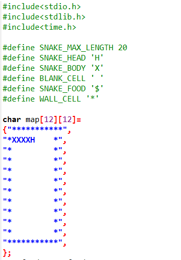
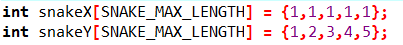
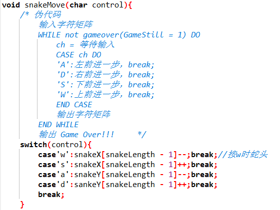
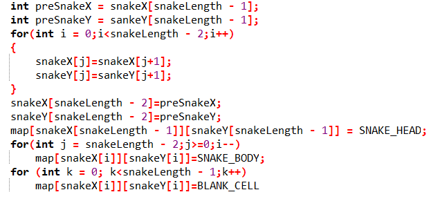

# 贪食蛇实验报告

## 本篇采用问题解决式来介绍我制作的贪食蛇；

### 1、地图用什么实现
由于我们只能采用C语言，能够打印出地图这种二维的东西第一个想到的就是数组，因此我们建立一个12*12的二维数组用来作为我们操作的背景地图，其中先定义了蛇头、墙、蛇身等的简略表示方式。

我用了比较看得懂的方式来定义了地图中的各个元素，那个X起头的字符串就是我们的蛇了！

### 2、如何实现控制蛇的运动
这一步目前我认为只能用wsad来实现了，wsad对应的是输入字符，可以由此来改变数组，可以用switch函数来实现这个操作，只需要同时对数组进行改变再打印出来即可！(这里的一个弊端可能是，每动一次就是一帧画面吧，然后刷一下的瞬间还是很明显的画面断裂敢，作为评游人还是有点不能接受。)

这里我把蛇的位置用两个一维数组记录下来，方便我下面的操作(二维数组一动就要带两个好麻烦噢)

这一步显然不能把数组的东西整个移动，而我做的只是把前一个的复制到后一个位置中，那么就会导致一个问题，蛇身会在这个时候变长，那么我就用到了空格，来更换这个数组里面的东西,并用了另一个数组来记录前一个身所在的位置。

### 3、Game Over怎么实现？
IF snakeX[snakeLength - 1]（头） == map[i][j]（墙）
THEN GameStill = 0;
printf GameOVER

我在开头定义了一个全局变量GameStill用于判断游戏继续的真假，在撞墙的时候他变为零，然后就能在Main函数里实现结束游戏了！

### 4、随机食物如何实现？
通过百度学习，学会了一个rand函数，在可控的范围内可以随意刷新,于是随机食物也轻而易举了。

### 5、蛇身变长如何实现？
这个我又用了一个判断的函数，当蛇头碰到食物就使判断函数为1 然后增长蛇身，接着把函数变为0；

### Main函数
就是不断地打印map数组就可以了！

## 感想
贪食蛇是一个我八百年前玩的小游戏，想不到实现起来如此困难，而且我实现的贪食蛇十分的粗糙，我真是菜啊