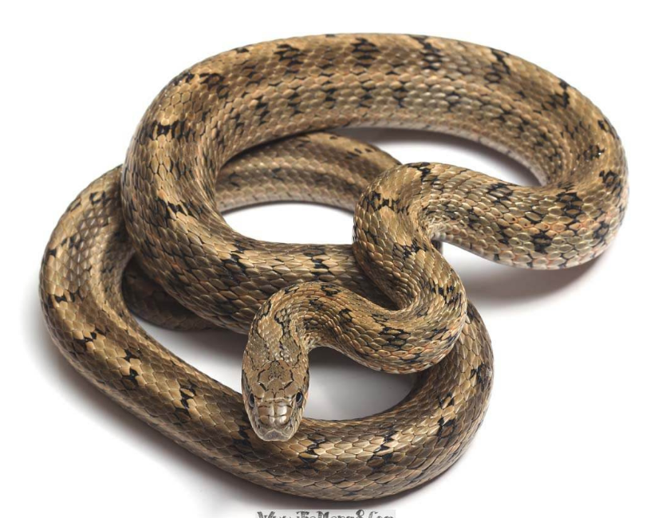

# 智能鞋

这条智能鞋怎么能自动去蠕动呢，我觉得做这样一个游戏的意义在哪里，让我去学习如何设计算法让一个东西变成一帧帧动画？对不起，做不到。

这样吧，我来说一说我理解算法，也不想百度了。

大概就是既然他是一个像素平面，那鞋的每一次运动都只能是上下左右四个方向吧，那我就把每一个方向的可能性存在一个内存空间里，然后选其中一条走走看，存空间里，然后走到食物那里，比较比较应该有挺多种的吧，然后说道智能就是应该它可以挑最短那种然后执行起来，也就是说我们看到鞋在走路的时候，其实电脑已经模拟了好多好多次的情况。

如果将这个像素平面看成是坐标轴的话，其鞋到食物，横轴走了一直是那么多，数轴走了也一直是那么多，所以数组的变化我觉得应该是很局限的，加上图那么小，应该可以在300行内实现吧。